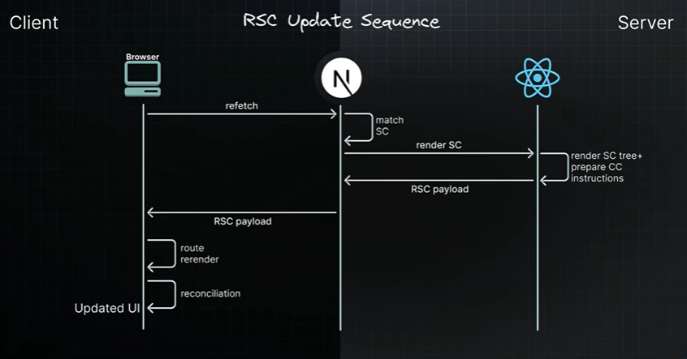

This is a [Next.js](https://nextjs.org) project bootstrapped with [`create-next-app`](https://nextjs.org/docs/app/api-reference/cli/create-next-app).

## Getting Started

First, run the development server:

```bash
npm run dev
# or
yarn dev
# or
pnpm dev
# or
bun dev
```

Open [http://localhost:3000](http://localhost:3000) with your browser to see the result.

1.  Client Side Rendering (CSR)
- This method of rendering, where the component code is transformed into a user interce directly within the browser, is known as Client Side Rendering (CSR).
- CSR quicklybecame the standard for SPAs, with widespread adoption.
- Drawbacks of CSR
  - SEO
    - Generating HTML that mainly contains a single div tag is not optimal for SEO, as it provides little content for search engines to index. 
  - Performance
    - Having the browser (the client) handle all th work, such as fetching data, computing the UI, and making the HTML interactive, can slow things down. Users might see a blank screen or a loading spinner while the page loads.
    - Eachnew feature increases the size of the JavaScript bundle, prolonging the wait time for users to see the UI.
  
2. Recollecting drawbacks of CSR
 - Reliance on JavaScript for rendering content on the client side can significantly hurt SEO as search engines might struggle to index the content properly.
 - The user experience can suffer from slow load times as the browser has to download parse and execute JavaScript before the user sees any meaningful content on the page.

3. Server Side Rendering (SSR)
 - Iserver side rendering was a significant improvement over client side rendering providing faster initial page loads and better SEO
 - Users can immediately see the page HTML content instead of a blank screen or loading spinner.

4. Hydration
- During hydration react takes control in the browser reconstructing the component Tree in memory based on the static HTML that was served. - It carefully plans the placement of interactive elements with in this tree. Then react proceeds to bind the necessary JavaScript logic to these elements. 
- This involves initializing the application State attaching event handlers for actions such as clicks and mouseovers and setting up any other Dynamic functionalities required for a fully interactive user experience.

5. Server Side Solutions 
- Can be categorized into two strategies static site generation or SSG and server side rendering or SSR.
- SSG occurs at build time when the application is deployed on the server. This results in pages that are already rendered and ready to serve. It is ideal for Content that doesn't change often like blog posts.
- SSR on the other hand renders pages on demand in response to user requests. It is suitable for personalized content like social media feeds where the HTML depends on the logged in user. Usually you'll see the two collectively being referred to as just serers side rendering or SSR.
- Server side rendering was a significant improvement over client side rendering providing faster initial page loads and better SEO.

6. Drawbacks of SSR
- You have to fetch everything before you can show anything
  - Components cannot start rendering and then pause or wait while the data is still being loaded.
  - If a component needs to fetch data from a database or another source like an API. This fetching must be completed before the server can begin rendering the page. 
  - This can delay the server's response time to the browser as the server must finish collecting all necessary Data before any part of the page can be sent to the client.
- You have to load everything before you can hydrate anything
  - Second issue with SSR is that for successful hydration where react adds interactivity to the server rendered HTML the component tree in the browser must exactly match the server generated component tree. 
  - This means that all the JavaScript for the components must be loaded on the client before you can start hydrating any of them.
- You have to hydrate everything before you can interact with anything
  - The third issue with SSR is related to hydration. React hydrates the component Tree in a single pass meaning once it starts hydrating it won't stop until it is finished with the entire tree.
  - As a consequence all components must be hydrated before you can interact with any of them.

7. Drawbacks of SSR - All or Nothing Waterfall
- First Data fetching must be completed before the server can begin rendering HTML
- Second the JavaScript required for the components needs to be fully loaded on the client side before the hydration process can start
- Third all components have to be hydrated before they become interactive

8. Suspense SSR architecture 
- Use the <suspense> component to unlock two major major SSR features:
  - HTML streaming on the server  
  - Selective hydration on the client 
- HTML streaming on the server
  - You don't have to fetch everything before you can show anything 
  - If a particular section delays the initial HTML it can be seamlessly integrated into the stream later.
  - This is the essence of how suspense facilitates servers side HTML streaming.  
- The other challange
  - Until the JavaScript for the main section is loaded, client side app hydration cannot start
  - And if the JavaScript bundle for the main section is large this could significantly delay the process
- Code splitting
  - Code splitting allows you to Mark specific code segments as not immediately necessary for loading signalling your bundler to segregate them into separate <script> tags 
  - Using react lazy for code splitting enables you to separate the main sections code from the primary JavaScript bundle.
  - As a result the JavaScript containing react and the code for the entire application excluding the main section can now be downloaded independently by the client without having to wait for the main sections code. 
  - By wrapping the main section within <suspense> you've indicated to react that it should not prevent the rest of the page from not just streaming but also from hydrating. This feature called selective hydration allows for the hydration of sections as they become available before the rest of the HTML and the JavaScript code are fully downloaded. 
- Selective hydration offers a solution to a third issue: the necessity to hydrate everything to interact with any thing 
- React begins hydrating as soon as possible enabling interactions with elements like the header and side navigation without waiting for the main content to be hydrated. 
- This process is managed automatically by react.
- and in scenarios where multiple components are awaiting hydration react prioritizes hydration based on user interactions.

9. Drawbacks of Suspense SSR
- First, even though JavaScript code is streamed to the browser asynchronously, eventually the entire code for a web page must be downloaded by the user 
- as applications add more features, the amount of code users need to download also grows. 
  - This leads to an important question: should users really have to download so much data? 
- Second, the current approach requires that all react components undergo hydration on the client side irrespective of their actual need for interactivity. 
- This process can inefficiently spend resources and extend the loading times and time to interactivity for users as their devices need to process and render components that might not even require client side interaction. 
  - This leads to another question: should all components be hydrated even those that don't need interactivity?
- Third, in spite of servers' Superior capacity for handling intensive processing tasks, the bulk of JavaScript execution still takes place on the user's device. 
  - This can slow down the performance especially on devices that are not very powerful. 
  - This leads to another important question: should so much of the work be done on the user's device?

### React Server Components
- The evolution of react
  - CSR - SSR - Suspense for SSR
  - Suspense for SSR brought us closer to a seamless rendering experience 
  - Challenges
    - increased bundle sizes leading to excessive download for users 
    - unnecessary hydration delaying interactivity 
    - extensive client side processing that could result in poor performance
- React server components
  - React server components represent a new architecture designed by the react team 
  - This approach aims to leverage the strengths of both server and client environments optimizing for efficiency load times and interactivity 
  - The architecture introduces a dual component model
    - Differentiating between client components and server components 
    - This distinction is not based on the functionality of the components but rather on where they execute and the specific environments they are designed to interact with.
- Client components
  - Client components are the familiar react components we've been using 
  - They are typically rendered on the client side(CSR) but they can also be rendered to HTML once on the server(SSR) allowing users to immediately see the Page's HTML content rather than a blank screen 
  - The idea of client components rendering on the server might seem confusing but it is helpful to view them as components that primarily run on the client but can and should also be executed once on the server as an optimization strategy.
  - Client components have access to the client environment, such as the browser, allowing them to use state, effects, and event listeners to handle interactivity and also access browser exclusive apis like geolocation or local storage allowing you to build UI for specific use cases.
  - In fact the term client component doesn't signify anything new it simply helps differentiate these components from the newly introduced server components 
- server components 
  - Server components on the other hand represent a new type of react component specifically designed to operate exclusively on the server and unlike client components their code stays on the server and is never downloaded to the client.
  - This design Choice offers multiple benefits to react applications
- Benefits 
  - first in terms of bundle sizes server components do not send code to the client allowing large dependencies to remain server side 
  - this benefits users with slower internet connections or less capable devices by eliminating the need to download pass and execute JavaScript for these components 
  - Addtionally it removes the hydration step speeding up app loading and interaction 
  - second by having direct access to serers side resources like databases or file systems server components enable efficient data fetching and rendering without needing additional client side processing 
  - leveraging the server's computational power and proximity to data sources they manage compute intensive rendering tasks and send only interactive pieces of code to the client 
  -third server components exclusive server site execution enhances security by keeping sensitive data and logic including tokens and API Keys away from the client side 
  - fourth server components enhance data fetching efficiency   
    - typically when fetching data on the client side using use effect a child component cannot begin loading its data until the parent component has finished loading its own 
    - this sequential fetching of data often leads to poor performance - the main issue is not the round trips themselves but that these round trips are made from the client to the server 
    - server components enable applications to shift these sequential round trips to the server side 
    - by moving this logic to the server request latency is reduced and overall performance is improved eliminating clients side waterfalls
  - fifth rendering on the server enables caching of the results which can be reused in subsequent requests and across different users 
    - this approach can significantly improve performance and reduce costs by minimizing the amount of rendering and data fetching required for each request 
  - sixth initial page load and first contentful paint are significantly improved with server components 
    - by generating HTML on the server Pages become immediately visible to users without the delay of downloading passsing and executing JavaScript 
  - seventh regarding search engine optimization the server rendered HTML is fully accessible to search engine Bots enhancing the indexability of your pages 
  - lastly there is streaming. server components allow the rendering process to be divided into manageable chunks which are then streamed to the client as soon as they are ready this approach allows users to start seeing parts of their page earlier eliminating the need to wait for the entire page to finish rendering on the server 
- with RSC architecture server components take charge of data fetching and static rendering while client components are tasked with rendering the interactive elements of the application 
- the bottom line is that the RSC architecture enables react applications to leverage the best aspects of both server and client rendering all while using a single language a single framework and a cohesive set of apis

- react server components introduce a new way of building react apps by separating components into two types 
- server components and client components 
- server components run only on the server accessing data and preparing content without being sent to the browser which makes the app faster for users because less information needs to download 
- they can't manage clicks or interactivity directly 
- client components on the other hand work in the users's browser and handle all the interactive parts of the app like clicking and typing 
- they can also be rendered on the server for a fast initial load of the site. the setup helps make websites faster more secure and easier for everyone to use no matter where they are or what device they're using.
- React and Next Js
  - the app router in next js is built around the RSC architecture  - - all the features and benefits we have discussed are already baked into the latest version of NEXTJs 
  - by understanding the evolution of reacts rendering you now have the necessary background for the rest of the section which will focus on next js
- Server components rendered on the server
- Client components rendered on the client and once on the server

- For React server components , its important t consider 3 elements-
 - your brwser (client), and on the server side, Next Js  and React
  
  
- Server rendering strategies
  - static 
  - dynamic
  - streaming
- Static rendering
  - Static rendering is a server rendering strategy where we generate HTML pages HTML pagees at the time of building our application.
  - This approach allows the page to be built once, cached by a CDN, and served to the client almost instantly.
  - This optimization also enables you to share the result of the rendering work among different users, resulting in a significant performance boost for your application.
  - Static rendering is particularly useful for Blog Pages, e-commerce product pages documentation and marketing Pages 
  - How to Statically Render ??
    - static rendering is the default rendering strategy in the app router 
    - all routes are automatically prepared at build time without additional setup.
    - production server and development server 
     - for production an optimized build is created once and you deploy that build 
     - development server on the other hand focuses on the developer experience 
     - we can't afford to build our application once make changes rebuild and so on 
     - for production builds, a page will be pre-rendered or statically rendered once when we run the build command 
     - in developement mode, a page will be pre-rendered or statically rendered for every request 
   - the build output into the next folder which contains various files and folders essential for serving our application to incoming requests from the browser here we can primarily focus on the server and static folders. 
  - prefetching is a technique used to preload a route in the background before the user navigates to it.
  - routes are automatically prefetched as they become visible in the user's viewport either when the page first loads or as it comes into view through scrolling 
  - for static routes the entire route is prefetched and cached by default 
  - therefore when we load the homepage next js prefetches the about and dashboard routes about if you did include a link keeping them ready for instant navigation. 
  - static rendering is a strategy where the HTML is generated at build time 
  - along with the HTML the RSC Pay load is created for each component and JavaScript chunks are produced for client side hydration in the browser 
  - if you navigate directly to a page route the corresponding HTML file is served 
  - however if you navigate to the route from a different one the route is created client side using the RSC payload and JavaScript chunks without any additional requests to the server.
  - static rendering is great for performance and use cases include blogs documentation marketing Pages Etc. 


  - in the previous video we learned about the first server rendering strategy namely static rendering.  
  - dynamic rendering 
    - Dynamic rendering is a server rendering strategy where routes are rendered for each user at request time 
    - it is useful when a route has data that is personalized to the user or contains information that can only be known at request time such as cookies or the url's search parameters 
    - news websites personalized e-commerce pages and social media feeds are some examples where Dynamic rendering is beneficial.
     - During rendering if a dynamic function is discovered nexs will automatically switch to dynamically rendering the whole route 
     - in Next Js the dynamic functions are cookies headers and search params which acts more like a prop available for every page. 
     - using any of these will opt the whole route into Dynamic rendering at request time 
    - Dynamic rendering is a strategy where the HTML is generated at request time 
    - next js automatically switches to Dynamic 	rendering when it comes across a dynamic function in the component such as cookies headers or the search params object 
    - this form of rendering is great for when we need to render HTML personalized to a user such as a social media feed 
    - as a developer you do not need to choose between static and dynamic rendering nextjs will automatically choose the best rendering strategy for each route based on the features and apis used 

- Streaming
    - Streaming is a strategy that allows for Progressive UI rendering from the server 
    - work is divided into chunks and streamed to the client as soon as it's ready. 
    - This enables users to see parts of the page immediately before the entire content has finished rendering. 
    - Streaming significantly improves both the initial page loading performance and the rendering of UI elements that rely on slower data fetches which would otherwise block the rendering of the entire route.
    - Streaming is integrated into the next js app router by default 

- Server Components
  - Fetching Data
  - Directly accessing backend resources
  - Protecting sensitive information ( like access tokens and API keys) on he server
  - Keeping large dependencies on the server side, which helps reducing client side JavaScript
- Client Components
  - Adding interactivity
  - Handling event listeners (onClick(), onMouseOver(), etc.)
  - Managing state and lifecycle effects ( using hook like useState, useEffect, etc.)
  - Using browser exclusive APIs ( geolocation, local storage, etc.)
  - Using custom hooks
  - Using react class components

- Server only code
  - Contain code is intended to execute only on the server 
  - You might have modules or functions that use multiple libraries, use environment variables interact directly with the database or process confidential information 
  - since JavaScript modules can be shared between both server and client components, it's possible for code that's meant only for the server to unintentionally end up in the client 
  - if servers side code gets bundled into the client side JavaScript, it could lead to a bloated bundle size, expose secret Keys, database queries and sensitive business logic.
  - it is crucial to separate server only code from client side code to protect the applications security and integrity.
  - to prevent unintended clients side usage of server code we can use a package called server only to provide a build time error, if developers accidentally import one of these modules into a client component.
  
  
  
   


